# Case Study: P01 - Manufacturing Yield & Downtime KPI System

## Project Overview

**Domain:** Manufacturing  
**Complexity:** Advanced  
**Status:** ✅ COMPLETE  
**Total Nodes:** 26 (Bronze: 6, Silver: 12, Gold: 8)  
**Execution Time:** 68.41ms

---

## Business Purpose

Track production efficiency, identify bottlenecks, and reduce downtime in manufacturing operations. This system provides real-time visibility into Overall Equipment Effectiveness (OEE), Mean Time Between Failures (MTBF), and yield rates across multiple production lines. By fusing data from machine sensors, production logs, and maintenance records, the system enables predictive maintenance scheduling, reduces unplanned downtime, and optimizes production throughput. Key stakeholders include plant managers, maintenance teams, and operations executives who use these insights to improve production efficiency and reduce operational costs.

---

## Data Sources

### Bronze Layer (3 Sources)

1. **machine_sensors.csv** (200 rows)
   - Schema: timestamp, machine_id, temperature, pressure, vibration, production_count, status
   - Refresh: Hourly
   - Purpose: Real-time machine health telemetry

2. **production_logs.json** (100 rows)
   - Schema: batch_id, machine_id, product_type, start_time, end_time, units_produced, units_defective, shift
   - Refresh: Per batch
   - Purpose: Production output and quality tracking

3. **maintenance_records.parquet** (50 rows)
   - Schema: maintenance_id, machine_id, maintenance_date, maintenance_type, downtime_hours, cost
   - Refresh: Daily
   - Purpose: Historical maintenance events and costs

**Total Bronze Nodes:** 6 (3 connect + 3 publish)

---

## Architecture

```mermaid
graph TB
    subgraph Bronze["🥉 Bronze Layer - Raw Ingestion"]
        B1[machine_sensors.csv]
        B2[production_logs.json]
        B3[maintenance_records.parquet]
        B1 --> B1P[bronze_machine_sensors.parquet]
        B2 --> B2P[bronze_production_logs.parquet]
        B3 --> B3P[bronze_maintenance_records.parquet]
    end

    subgraph Silver["🥈 Silver Layer - Transformation"]
        B1P --> S1[Transform: Sensor Data]
        B2P --> S2[Transform: Production Data]
        B3P --> S3[Transform: Maintenance Data]
        S1 --> J1[Join: Sensors ⋈ Production]
        S2 --> J1
        J1 --> J2[Join: Combined ⋈ Maintenance]
        S3 --> J2
        J2 --> D1[Derive: 6 Calculated Fields]
        D1 --> V1[Validate: Schema/Range/Business]
        V1 --> C1[Cache]
        C1 --> SP[silver_manufacturing_unified.parquet]
    end

    subgraph Gold["🥇 Gold Layer - Analytics"]
        SP --> G1[Aggregate: Machine + Shift + Day]
        G1 --> K1[Calculate: OEE Score]
        G1 --> K2[Calculate: MTBF]
        G1 --> K3[Calculate: Yield Rate]
        G1 --> K4[Calculate: Downtime Cost]
        G1 --> K5[Calculate: Throughput]
        K1 --> GP1[gold_manufacturing_kpis_daily.parquet]
        K2 --> GP1
        K3 --> GP1
        K4 --> GP2[gold_manufacturing_kpis_by_machine.parquet]
        K5 --> GP2
    end

    style Bronze fill:#cd7f32,stroke:#000,stroke-width:2px,color:#000
    style Silver fill:#c0c0c0,stroke:#000,stroke-width:2px,color:#000
    style Gold fill:#ffd700,stroke:#000,stroke-width:2px,color:#000
```

---

## Transformation Highlights

### Silver Layer Joins

1. **Machine Sensors ⋈ Production Logs** (on machine_id)
   - Correlates sensor telemetry with production output
   - Enables detection of performance degradation patterns

2. **Combined ⋈ Maintenance Records** (on machine_id)
   - Links production data to maintenance history
   - Identifies downtime patterns and cost drivers

### Derived Fields (6)

| Field | Formula | Purpose |
|-------|---------|---------|
| `oee_score` | (production_count / target_count) × quality_rate × availability_rate | Overall equipment effectiveness |
| `yield_rate` | (units_produced - units_defective) / units_produced | Quality metric |
| `downtime_ratio` | downtime_hours / total_hours | Availability metric |
| `avg_temperature` | rolling_mean(temperature, window=10) | Sensor health indicator |
| `production_efficiency` | units_produced / production_time_hours | Throughput metric |
| `maintenance_cost_per_unit` | maintenance_cost / units_produced | Cost efficiency |

### Validations

- **Schema Check:** Required columns exist (timestamp, machine_id, units_produced)
- **Range Validation:** temperature 0-150°C, pressure 0-200 PSI
- **Business Rule:** yield_rate must be between 0 and 1

---

## Key Performance Indicators

### Gold Layer KPIs (5)

#### 1. OEE (Overall Equipment Effectiveness)
**Formula:** `OEE = Availability × Performance × Quality`
- Availability = (Operating Time - Downtime) / Operating Time
- Performance = Actual Production / Target Production
- Quality = Good Units / Total Units
- **Target:** > 85%
- **Aggregation:** By machine, shift, product type, date

#### 2. MTBF (Mean Time Between Failures)
**Formula:** `MTBF = Total Operating Hours / Number of Failures`
- **Unit:** Hours
- **Target:** > 200 hours
- **Use Case:** Predictive maintenance scheduling

#### 3. Yield Rate
**Formula:** `Yield = (Units Produced - Defects) / Units Produced × 100`
- **Unit:** Percentage
- **Target:** > 95%
- **Breakdown:** By product type and shift

#### 4. Downtime Cost
**Formula:** `Downtime Cost = Downtime Hours × (Labor Cost + Opportunity Cost)`
- **Unit:** USD
- **Breakdown:** Planned vs. Unplanned downtime

#### 5. Production Throughput
**Formula:** `Throughput = Total Units Produced / Total Time`
- **Unit:** Units/Hour
- **Aggregation:** By machine, shift, product type

---

## Node Count Summary

| Layer | Node Types | Count |
|-------|-----------|-------|
| **Bronze** | 3 connect + 3 publish | 6 |
| **Silver** | 3 connect + 3 transform + 2 join + 1 validate + 1 cache + 2 publish | 12 |
| **Gold** | 1 connect + 5 transform + 2 publish | 8 |
| **TOTAL** | | **26** |

---

## Lessons Learned

This project demonstrates advanced multi-sensor fusion with time-series analysis, showcasing ODIBI_CORE's ability to handle complex manufacturing IoT data. The implementation highlights the importance of caching at transformation boundaries to optimize performance when joining large sensor datasets, and proves that comprehensive validation layers are essential for ensuring data quality in production environments where decisions impact physical operations.

---

*Generated by ODIBI_CORE Case Study Generator*  
*Project: P01 | Status: COMPLETE | Date: 2025-11-02*
