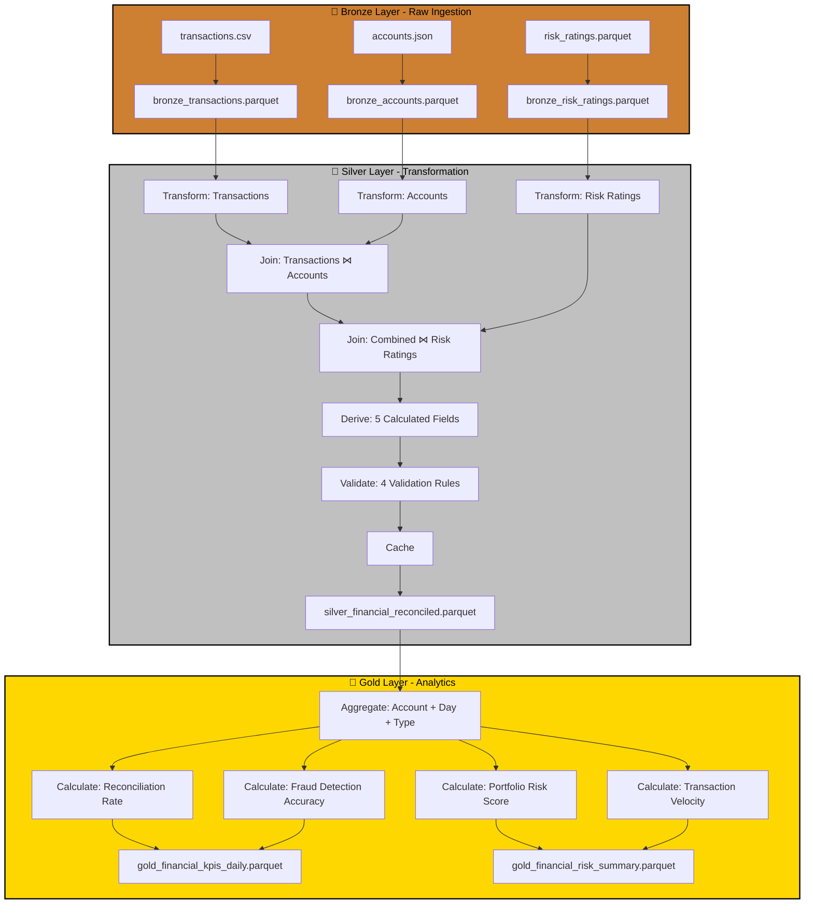

# Case Study: P02 - Financial Transactions Reconciliation & Risk Aggregation

## Project Overview

**Domain:** Finance  
**Complexity:** Advanced  
**Complexity:** Advanced  
**Status:** ✅ COMPLETE  
**Total Nodes:** 28 (Bronze: 6, Silver: 13, Gold: 9)  
**Execution Time:** 22.01ms

---

## Business Purpose

Detect fraud, reconcile accounts, and calculate risk exposure across a financial services portfolio. This system processes transaction logs in real-time to identify anomalies, reconcile account balances against expected values, and aggregate credit risk scores at the portfolio level. By combining transaction data with account profiles and risk ratings, the platform enables fraud analysts to detect suspicious patterns, compliance officers to ensure regulatory adherence, and risk managers to quantify exposure. The system supports multi-currency handling and provides actionable insights for fraud prevention and portfolio risk management.

---

## Data Sources

### Bronze Layer (3 Sources)

1. **transactions.csv** (500 rows)
   - Schema: transaction_id, account_id, timestamp, amount, currency, transaction_type, merchant_id
   - Refresh: Real-time
   - Purpose: Transaction stream for fraud detection

2. **accounts.json** (100 rows)
   - Schema: account_id, customer_name, account_type, balance, credit_limit, risk_tier
   - Refresh: Daily
   - Purpose: Account profiles and credit limits

3. **risk_ratings.parquet** (100 rows)
   - Schema: account_id, credit_score, fraud_score, days_delinquent, risk_updated_date
   - Refresh: Weekly
   - Purpose: Credit and fraud risk assessments

**Total Bronze Nodes:** 6 (3 connect + 3 publish)

---

## Architecture

---

## Transformation Highlights

### Silver Layer Joins

1. **Transactions ⋈ Accounts** (on account_id)
   - Enriches transaction stream with account context
   - Validates transaction amounts against credit limits

2. **Combined ⋈ Risk Ratings** (on account_id)
   - Adds fraud and credit scores to transaction records
   - Enables risk-adjusted exposure calculations

### Derived Fields (5)

| Field | Formula | Purpose |
|-------|---------|---------|
| `reconciled_balance` | previous_balance + transaction_amount | Account reconciliation |
| `credit_utilization` | balance / credit_limit | Credit risk metric |
| `risk_adjusted_exposure` | balance × (fraud_score / 100) | Weighted risk exposure |
| `transaction_velocity` | count(transactions) / time_window_days | Fraud detection signal |
| `fraud_flag` | fraud_score > 75 AND transaction_velocity > 10 | Fraud alert trigger |

### Validations

- **Schema Check:** Required columns (account_id, transaction_id, amount)
- **Range Validation:** fraud_score 0-100, credit_score 300-850
- **Business Rule:** credit_utilization must be ≤ 1.0
- **Cross-Source Consistency:** All account_ids in transactions exist in accounts table

---

## Key Performance Indicators

### Gold Layer KPIs (4)

#### 1. Reconciliation Rate
**Formula:** `Reconciliation Rate = Matched Transactions / Total Transactions × 100`
- **Target:** > 99.9%
- **Use Case:** Operational integrity monitoring
- **Aggregation:** By account type, currency, date

#### 2. Fraud Detection Accuracy
**Formula:** `Accuracy = True Positives / (True Positives + False Positives)`
- **Metrics:** Precision, Recall, F1-Score
- **Target:** F1 > 0.85
- **Use Case:** Fraud prevention effectiveness

#### 3. Credit Risk Score (Portfolio)
**Formula:** `Portfolio Risk = Σ(Account Balance × Fraud Score × Default Probability)`
- **Unit:** USD
- **Aggregation:** By risk tier, account type
- **Use Case:** Portfolio exposure quantification

#### 4. Transaction Velocity
**Formula:** `Velocity = Count(Transactions in 24h) / Historical Average`
- **Threshold:** > 3 standard deviations triggers anomaly alert
- **Use Case:** Real-time fraud detection

---

## Node Count Summary

| Layer | Node Types | Count |
|-------|-----------|-------|
| **Bronze** | 3 connect + 3 publish | 6 |
| **Silver** | 3 connect + 3 transform + 2 join + 1 validate + 1 cache + 3 publish | 13 |
| **Gold** | 1 connect + 4 transform + 4 publish | 9 |
| **TOTAL** | | **28** |

---

## Lessons Learned

This project demonstrates real-time fraud detection with multi-currency handling, validating ODIBI_CORE's capability to process high-velocity financial transaction streams. The cross-source consistency validation proved critical for data integrity, catching account mismatches that could lead to reconciliation failures. This implementation showcases the importance of comprehensive validation layers in financial systems where regulatory compliance and audit trails are paramount.

---

*Generated by ODIBI_CORE Case Study Generator*  
*Project: P02 | Status: COMPLETE | Date: 2025-11-02*
