# Case Study: P03 - IoT Sensor Reliability & Maintenance Prediction

## Project Overview

**Domain:** IoT / Predictive Maintenance  
**Complexity:** Advanced  
**Status:** ✅ COMPLETE  
**Total Nodes:** 28 (Bronze: 6, Silver: 14, Gold: 8)  
**Execution Time:** 23.01ms

---

## Business Purpose

Predict sensor failures and optimize maintenance schedules for distributed IoT infrastructure. This system analyzes sensor telemetry, maintenance logs, and weather data to forecast equipment failures before they occur, enabling proactive maintenance that reduces downtime and operational costs. By correlating sensor health indicators (battery level, signal strength, temperature) with environmental conditions and historical maintenance patterns, the platform helps operations teams schedule preventive maintenance during optimal windows. The predictive capabilities deliver significant cost savings by transitioning from reactive to predictive maintenance strategies.

---

## Data Sources

### Bronze Layer (3 Sources)

1. **sensor_telemetry.csv** (300 rows)
   - Schema: timestamp, sensor_id, temperature, humidity, battery_level, signal_strength, status
   - Refresh: 30-minute intervals
   - Purpose: Real-time sensor health monitoring

2. **maintenance_logs.json** (40 rows)
   - Schema: maintenance_id, sensor_id, maintenance_date, issue_type, resolution_time_hours, cost
   - Refresh: As-needed
   - Purpose: Maintenance event tracking

3. **weather_data.parquet** (30 rows)
   - Schema: date, location, avg_temperature, precipitation_mm, wind_speed_kph
   - Refresh: Daily
   - Purpose: Environmental impact analysis

**Total Bronze Nodes:** 6 (3 connect + 3 publish)

---

## Architecture

```mermaid
graph TB
    subgraph Bronze["🥉 Bronze Layer - Raw Ingestion"]
        B1[sensor_telemetry.csv]
        B2[maintenance_logs.json]
        B3[weather_data.parquet]
        B1 --> B1P[bronze_sensor_telemetry.parquet]
        B2 --> B2P[bronze_maintenance_logs.parquet]
        B3 --> B3P[bronze_weather_data.parquet]
    end

    subgraph Silver["🥈 Silver Layer - Transformation"]
        B1P --> S1[Transform: Telemetry]
        B2P --> S2[Transform: Maintenance]
        B3P --> S3[Transform: Weather]
        S1 --> J1[Join: Telemetry ⋈ Maintenance]
        S2 --> J1
        J1 --> J2[Join: Combined ⋈ Weather]
        S3 --> J2
        J2 --> D1[Derive: 6 Calculated Fields]
        D1 --> V1[Validate: Schema/Range/Business]
        V1 --> C1[Cache]
        C1 --> SP[silver_iot_reliability.parquet]
    end

    subgraph Gold["🥇 Gold Layer - Analytics"]
        SP --> G1[Aggregate: Sensor + Location + Week]
        G1 --> K1[Calculate: Sensor Uptime]
        G1 --> K2[Calculate: Prediction Accuracy]
        G1 --> K3[Calculate: Maintenance Cost Savings]
        G1 --> K4[Calculate: Battery Health Index]
        K1 --> GP1[gold_iot_reliability_weekly.parquet]
        K2 --> GP1
        K3 --> GP2[gold_iot_maintenance_forecast.parquet]
        K4 --> GP2
    end

    style Bronze fill:#cd7f32,stroke:#000,stroke-width:2px,color:#000
    style Silver fill:#c0c0c0,stroke:#000,stroke-width:2px,color:#000
    style Gold fill:#ffd700,stroke:#000,stroke-width:2px,color:#000
```

---

## Transformation Highlights

### Silver Layer Joins

1. **Sensor Telemetry ⋈ Maintenance Logs** (on sensor_id)
   - Correlates sensor health metrics with maintenance history
   - Identifies patterns leading to failures

2. **Combined ⋈ Weather Data** (on date extracted from timestamp)
   - Enriches sensor data with environmental context
   - Quantifies weather impact on sensor reliability

### Derived Fields (6)

| Field | Formula | Purpose |
|-------|---------|---------|
| `uptime_ratio` | count(status='online') / total_readings | Availability metric |
| `battery_drain_rate` | diff(battery_level) / diff(timestamp) | Battery health trend |
| `failure_prediction_score` | f(battery_level, signal_strength, uptime_ratio) | Predictive alert |
| `weather_impact_score` | correlation(sensor_failures, precipitation) | Environmental factor |
| `mtbf_days` | days_between_maintenance_events | Reliability metric |
| `maintenance_cost_per_day` | total_maintenance_cost / days_operational | Cost efficiency |

### Validations

- **Schema Check:** Required fields (sensor_id, timestamp, battery_level)
- **Range Validation:** battery_level 0-100%, signal_strength -90 to -30 dBm
- **Business Rule:** uptime_ratio must be > 0.90 for production sensors

---

## Key Performance Indicators

### Gold Layer KPIs (4)

#### 1. Sensor Uptime
**Formula:** `Uptime = Online Hours / Total Hours × 100`
- **Target:** > 99.5%
- **Aggregation:** By sensor, location, week
- **Use Case:** SLA monitoring

#### 2. Prediction Accuracy
**Formula:** `Accuracy = Correct Predictions / Total Predictions`
- **Breakdown:** True positive, false positive, false negative rates
- **Target:** > 90%
- **Use Case:** Model performance tracking

#### 3. Maintenance Cost Savings
**Formula:** `Savings = (Reactive Cost - Predictive Cost) / Reactive Cost × 100`
- **Comparison:** Planned vs. emergency maintenance costs
- **Target:** 30% reduction
- **Use Case:** ROI justification

#### 4. Battery Health Index
**Formula:** `Health Index = Battery Level × (1 - Drain Rate) × Uptime Ratio`
- **Range:** 0-100
- **Action Trigger:** < 30 requires replacement
- **Use Case:** Proactive battery replacement scheduling

---

## Node Count Summary

| Layer | Node Types | Count |
|-------|-----------|-------|
| **Bronze** | 3 connect + 3 publish | 6 |
| **Silver** | 3 connect + 3 transform + 2 join + 1 validate + 1 cache + 4 publish | 14 |
| **Gold** | 1 connect + 4 transform + 3 publish | 8 |
| **TOTAL** | | **28** |

---

## Lessons Learned

This project showcases anomaly detection with predictive modeling, demonstrating ODIBI_CORE's ability to handle time-series sensor data with weather correlation. The weather join pattern proved essential for distinguishing environmental-induced failures from true equipment degradation, significantly improving prediction accuracy and reducing false positives in maintenance alerts.

---

*Generated by ODIBI_CORE Case Study Generator*  
*Project: P03 | Status: COMPLETE | Date: 2025-11-02*
