# Case Study: P04 - Retail Demand Forecast & Promotion Effectiveness

## Project Overview

**Domain:** Retail  
**Complexity:** Medium  
**Status:** ✅ COMPLETE  
**Total Nodes:** 31 (Bronze: 6, Silver: 15, Gold: 10)  
**Execution Time:** 23.00ms

---

## Business Purpose

Optimize inventory levels and measure marketing ROI through demand forecasting and promotion analysis. This system combines sales transaction data with inventory levels and promotional campaign metrics to predict future demand, quantify promotion effectiveness, and prevent stock-outs. By analyzing historical sales patterns, current inventory positions, and marketing spend, the platform enables merchandising teams to optimize stock levels, marketing teams to measure campaign lift, and finance teams to calculate return on promotional investments. The insights drive data-driven decisions on inventory allocation and marketing budget optimization.

---

## Data Sources

### Bronze Layer (3 Sources)

1. **sales_transactions.csv** (400 rows)
   - Schema: transaction_id, timestamp, store_id, product_id, quantity, price, discount_applied
   - Refresh: Real-time
   - Purpose: Point-of-sale transaction capture

2. **inventory_levels.json** (50 rows)
   - Schema: product_id, product_name, category, current_stock, reorder_point, supplier_id
   - Refresh: Daily
   - Purpose: Stock availability tracking

3. **promotional_campaigns.parquet** (20 rows)
   - Schema: campaign_id, start_date, end_date, product_id, discount_rate, marketing_spend
   - Refresh: Weekly
   - Purpose: Marketing campaign tracking

**Total Bronze Nodes:** 6 (3 connect + 3 publish)

---

## Architecture

```mermaid
graph TB
    subgraph Bronze["🥉 Bronze Layer - Raw Ingestion"]
        B1[sales_transactions.csv]
        B2[inventory_levels.json]
        B3[promotional_campaigns.parquet]
        B1 --> B1P[bronze_sales_transactions.parquet]
        B2 --> B2P[bronze_inventory_levels.parquet]
        B3 --> B3P[bronze_promotional_campaigns.parquet]
    end

    subgraph Silver["🥈 Silver Layer - Transformation"]
        B1P --> S1[Transform: Sales]
        B2P --> S2[Transform: Inventory]
        B3P --> S3[Transform: Promotions]
        S1 --> J1[Join: Sales ⋈ Inventory]
        S2 --> J1
        J1 --> J2[Join: Combined ⋈ Campaigns]
        S3 --> J2
        J2 --> D1[Derive: 7 Calculated Fields]
        D1 --> V1[Validate: Schema/Range/Business]
        V1 --> C1[Cache]
        C1 --> SP[silver_retail_demand.parquet]
    end

    subgraph Gold["🥇 Gold Layer - Analytics"]
        SP --> G1[Aggregate: Product + Store + Week]
        G1 --> K1[Calculate: Forecast Accuracy MAPE]
        G1 --> K2[Calculate: Promotion Lift]
        G1 --> K3[Calculate: Inventory Turnover]
        G1 --> K4[Calculate: Marketing ROI]
        G1 --> K5[Calculate: Stock-Out Rate]
        K1 --> GP1[gold_retail_demand_forecast.parquet]
        K2 --> GP1
        K3 --> GP1
        K4 --> GP2[gold_retail_promotion_effectiveness.parquet]
        K5 --> GP2
    end

    style Bronze fill:#cd7f32,stroke:#000,stroke-width:2px,color:#000
    style Silver fill:#c0c0c0,stroke:#000,stroke-width:2px,color:#000
    style Gold fill:#ffd700,stroke:#000,stroke-width:2px,color:#000
```

---

## Transformation Highlights

### Silver Layer Joins

1. **Sales Transactions ⋈ Inventory Levels** (on product_id)
   - Links sales velocity to current stock levels
   - Identifies stock-out risks

2. **Combined ⋈ Promotional Campaigns** (on product_id + date range)
   - Attributes sales lift to specific campaigns
   - Calculates incremental revenue from promotions

### Derived Fields (7)

| Field | Formula | Purpose |
|-------|---------|---------|
| `revenue` | quantity × price × (1 - discount_applied) | Net revenue calculation |
| `promotion_lift` | (sales_during_promo - baseline_sales) / baseline_sales | Campaign effectiveness |
| `inventory_turnover` | sales_quantity / current_stock | Stock velocity |
| `stock_out_risk` | current_stock < reorder_point | Replenishment alert |
| `days_of_supply` | current_stock / avg_daily_sales | Inventory adequacy |
| `marketing_roi` | (revenue_during_campaign - marketing_spend) / marketing_spend | Campaign profitability |
| `demand_forecast_7d` | trend + seasonality component | Future demand prediction |

### Validations

- **Schema Check:** Required fields (product_id, quantity, price)
- **Range Validation:** discount_applied 0-1, quantity > 0
- **Business Rule:** revenue must be positive after discounts

---

## Key Performance Indicators

### Gold Layer KPIs (5)

#### 1. Forecast Accuracy (MAPE)
**Formula:** `MAPE = (1/n) × Σ|Actual - Forecast| / Actual × 100`
- **Target:** < 15%
- **Use Case:** Demand planning accuracy
- **Aggregation:** By product, category, week

#### 2. Promotion Lift
**Formula:** `Lift = (Sales During Promo - Baseline Sales) / Baseline Sales × 100`
- **Target:** > 20%
- **Use Case:** Marketing campaign effectiveness
- **Breakdown:** By campaign type, product category

#### 3. Inventory Turnover
**Formula:** `Turnover = COGS / Average Inventory`
- **Target:** > 8 (monthly)
- **Use Case:** Working capital efficiency
- **Aggregation:** By store, product, category

#### 4. Marketing ROI
**Formula:** `ROI = (Revenue - Marketing Spend) / Marketing Spend × 100`
- **Target:** > 300%
- **Use Case:** Budget allocation optimization

#### 5. Stock-Out Rate
**Formula:** `Stock-Out Rate = Days Out of Stock / Total Days × 100`
- **Target:** < 2%
- **Use Case:** Service level monitoring

---

## Node Count Summary

| Layer | Node Types | Count |
|-------|-----------|-------|
| **Bronze** | 3 connect + 3 publish | 6 |
| **Silver** | 3 connect + 3 transform + 2 join + 1 validate + 1 cache + 5 publish | 15 |
| **Gold** | 1 connect + 5 transform + 4 publish | 10 |
| **TOTAL** | | **31** |

---

## Lessons Learned

This project exemplifies time-series forecasting with attribution modeling, highlighting ODIBI_CORE's strength in blending historical trends with real-time events. The date-range join for promotional campaigns demonstrated the framework's flexibility in handling temporal joins, while the multi-metric approach to promotion effectiveness (lift, ROI, incremental revenue) showcases comprehensive business impact analysis.

---

*Generated by ODIBI_CORE Case Study Generator*  
*Project: P04 | Status: COMPLETE | Date: 2025-11-02*
