# Case Study: P05 - Healthcare Appointment Analytics & Wait-Time Reduction

## Project Overview

**Domain:** Healthcare  
**Complexity:** Medium  
**Status:** ✅ COMPLETE  
**Total Nodes:** 27 (Bronze: 6, Silver: 13, Gold: 8)  
**Execution Time:** 22.00ms

---

## Business Purpose

Improve patient experience and optimize clinic scheduling through appointment analytics and wait-time monitoring. This system tracks appointment flow from scheduled time to actual start, analyzing wait times across doctors, appointment types, and patient demographics to identify bottlenecks in clinical operations. By correlating clinic capacity with actual utilization and patient no-show patterns, the platform helps healthcare administrators optimize scheduling templates, reduce patient wait times, and improve resource allocation. The insights drive operational improvements that enhance patient satisfaction while maximizing clinic throughput.

---

## Data Sources

### Bronze Layer (3 Sources)

1. **appointment_records.csv** (300 rows)
   - Schema: appointment_id, patient_id, doctor_id, scheduled_time, actual_start_time, appointment_type, status
   - Refresh: Hourly
   - Purpose: Appointment flow tracking

2. **patient_demographics.json** (100 rows)
   - Schema: patient_id, age, gender, insurance_type, chronic_conditions, risk_score
   - Refresh: Daily
   - Purpose: Patient profile context

3. **clinic_capacity.parquet** (30 rows)
   - Schema: date, doctor_id, available_slots, booked_slots, avg_appointment_duration_min
   - Refresh: Daily
   - Purpose: Resource capacity planning

**Total Bronze Nodes:** 6 (3 connect + 3 publish)

---

## Architecture

```mermaid
graph TB
    subgraph Bronze["🥉 Bronze Layer - Raw Ingestion"]
        B1[appointment_records.csv]
        B2[patient_demographics.json]
        B3[clinic_capacity.parquet]
        B1 --> B1P[bronze_appointment_records.parquet]
        B2 --> B2P[bronze_patient_demographics.parquet]
        B3 --> B3P[bronze_clinic_capacity.parquet]
    end

    subgraph Silver["🥈 Silver Layer - Transformation"]
        B1P --> S1[Transform: Appointments]
        B2P --> S2[Transform: Demographics]
        B3P --> S3[Transform: Capacity]
        S1 --> J1[Join: Appointments ⋈ Demographics]
        S2 --> J1
        J1 --> J2[Join: Combined ⋈ Capacity]
        S3 --> J2
        J2 --> D1[Derive: 6 Calculated Fields]
        D1 --> V1[Validate: Schema/Range/Business]
        V1 --> C1[Cache]
        C1 --> SP[silver_healthcare_appointments.parquet]
    end

    subgraph Gold["🥇 Gold Layer - Analytics"]
        SP --> G1[Aggregate: Doctor + Clinic + Week]
        G1 --> K1[Calculate: Avg Wait Time]
        G1 --> K2[Calculate: Appointment Utilization]
        G1 --> K3[Calculate: No-Show Rate]
        G1 --> K4[Calculate: Wait-Time Reduction]
        K1 --> GP1[gold_healthcare_wait_time_kpis.parquet]
        K2 --> GP1
        K3 --> GP2[gold_healthcare_utilization_by_doctor.parquet]
        K4 --> GP2
    end

    style Bronze fill:#cd7f32,stroke:#000,stroke-width:2px,color:#000
    style Silver fill:#c0c0c0,stroke:#000,stroke-width:2px,color:#000
    style Gold fill:#ffd700,stroke:#000,stroke-width:2px,color:#000
```

---

## Transformation Highlights

### Silver Layer Joins

1. **Appointment Records ⋈ Patient Demographics** (on patient_id)
   - Enriches appointments with patient complexity indicators
   - Enables analysis of wait times by patient risk profile

2. **Combined ⋈ Clinic Capacity** (on doctor_id + date)
   - Links actual appointments to available capacity
   - Calculates utilization rates and overbooking patterns

### Derived Fields (6)

| Field | Formula | Purpose |
|-------|---------|---------|
| `wait_time_minutes` | diff(scheduled_time, actual_start_time) | Patient experience metric |
| `utilization_rate` | booked_slots / available_slots | Capacity optimization |
| `no_show_rate` | count(status='no-show') / total_appointments | Revenue leakage |
| `avg_wait_by_appointment_type` | group_mean(wait_time, appointment_type) | Service type analysis |
| `patient_complexity_score` | chronic_conditions × risk_score | Care requirements |
| `on_time_performance` | count(wait_time <= 15) / total_appointments | Service quality |

### Validations

- **Schema Check:** Required fields (appointment_id, scheduled_time, doctor_id)
- **Range Validation:** wait_time >= -30 (early arrivals), utilization_rate 0-1.5
- **Business Rule:** appointment_duration must be > 0

---

## Key Performance Indicators

### Gold Layer KPIs (4)

#### 1. Average Wait Time
**Formula:** `Avg Wait = Σ(Actual Start - Scheduled) / Total Appointments`
- **Unit:** Minutes
- **Target:** < 15 minutes
- **Aggregation:** By doctor, appointment type, clinic, week

#### 2. Appointment Utilization
**Formula:** `Utilization = Booked Slots / Available Slots × 100`
- **Target:** 85-95% (optimal range)
- **Use Case:** Capacity planning and scheduling optimization
- **Alert:** < 70% underutilized, > 100% overbooking

#### 3. No-Show Rate
**Formula:** `No-Show Rate = No-Shows / Total Appointments × 100`
- **Target:** < 10%
- **Use Case:** Revenue recovery and scheduling buffer
- **Breakdown:** By insurance type, patient demographics

#### 4. Patient Wait-Time Reduction
**Formula:** `Reduction = (Previous Wait - Current Wait) / Previous Wait × 100`
- **Trend:** Month-over-month improvement
- **Target:** 20% reduction Year-over-Year
- **Use Case:** Continuous improvement tracking

---

## Node Count Summary

| Layer | Node Types | Count |
|-------|-----------|-------|
| **Bronze** | 3 connect + 3 publish | 6 |
| **Silver** | 3 connect + 3 transform + 2 join + 1 validate + 1 cache + 3 publish | 13 |
| **Gold** | 1 connect + 4 transform + 3 publish | 8 |
| **TOTAL** | | **27** |

---

## Lessons Learned

This project demonstrates resource optimization with patient flow analysis, showcasing ODIBI_CORE's ability to handle healthcare operational data with privacy considerations. The dual focus on utilization (85-95% optimal range) and wait-time reduction highlights the balance between efficiency and patient experience, proving that effective scheduling requires multi-dimensional analysis beyond simple capacity metrics.

---

*Generated by ODIBI_CORE Case Study Generator*  
*Project: P05 | Status: COMPLETE | Date: 2025-11-02*
