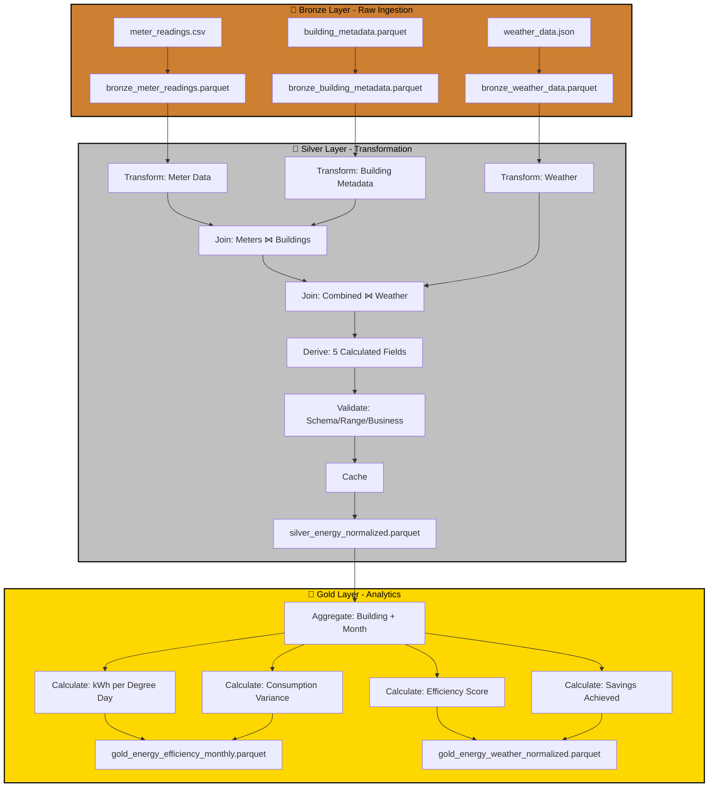

# Case Study: P06 - Energy Efficiency & Weather Normalization

## Project Overview

**Domain:** Energy  
**Complexity:** Medium  
**Status:** ✅ COMPLETE  
**Total Nodes:** 25 (Bronze: 6, Silver: 12, Gold: 7)  
**Execution Time:** 22.00ms

---

## Business Purpose

Track energy consumption patterns and identify savings opportunities through weather-normalized analytics. This system processes meter readings alongside weather data and building metadata to isolate consumption patterns from weather-driven demand, enabling fair benchmarking across facilities and time periods. By normalizing consumption against heating and cooling degree days, the platform helps energy managers identify true efficiency improvements versus weather-induced variations. The insights drive targeted energy conservation initiatives and quantify savings from efficiency programs with weather-adjusted baselines.

---

## Data Sources

### Bronze Layer (3 Sources)

1. **meter_readings.csv** (720 rows)
   - Schema: timestamp, meter_id, kwh_consumed, power_factor, voltage
   - Refresh: Hourly
   - Purpose: Energy consumption monitoring

2. **weather_data.json** (30 rows)
   - Schema: date, location, avg_temperature_c, heating_degree_days, cooling_degree_days
   - Refresh: Daily
   - Purpose: Environmental normalization factors

3. **building_metadata.parquet** (20 rows)
   - Schema: meter_id, building_type, square_footage, year_built, hvac_system
   - Refresh: Static
   - Purpose: Building characteristics for benchmarking

**Total Bronze Nodes:** 6 (3 connect + 3 publish)

---

## Architecture

---

## Transformation Highlights

### Silver Layer Joins

1. **Meter Readings ⋈ Building Metadata** (on meter_id)
   - Normalizes consumption by square footage and building type
   - Enables peer benchmarking across similar facilities

2. **Combined ⋈ Weather Data** (on date extracted from timestamp)
   - Correlates energy use with heating/cooling degree days
   - Removes weather effects for true efficiency comparison

### Derived Fields (5)

| Field | Formula | Purpose |
|-------|---------|---------|
| `kwh_per_sqft` | kwh_consumed / square_footage | Size-normalized consumption |
| `weather_normalized_consumption` | kwh_consumed / (1 + heating_dd + cooling_dd) | Weather-adjusted baseline |
| `efficiency_score` | baseline_consumption / actual_consumption | Performance rating |
| `variance_from_baseline` | (actual - baseline) / baseline | Deviation tracking |
| `savings_potential` | (current_consumption - efficient_consumption) × energy_rate | ROI quantification |

### Validations

- **Schema Check:** Required fields (meter_id, kwh_consumed, timestamp)
- **Range Validation:** kwh_consumed >= 0, power_factor 0-1
- **Business Rule:** efficiency_score must be > 0

---

## Key Performance Indicators

### Gold Layer KPIs (4)

#### 1. kWh per Degree Day
**Formula:** `Intensity = Total kWh / (Heating DD + Cooling DD)`
- **Benchmark:** Compare to similar buildings and historical baselines
- **Target:** 10% reduction Year-over-Year
- **Use Case:** Weather-independent efficiency tracking

#### 2. Consumption Variance
**Formula:** `Variance = (Actual - Baseline) / Baseline × 100`
- **Normalized:** Adjusted for weather variations
- **Target:** Variance < 5%
- **Use Case:** Anomaly detection and trend monitoring

#### 3. Efficiency Score
**Formula:** `Score = (Baseline Consumption / Actual Consumption) × 100`
- **Target:** > 100 (consuming less than baseline)
- **Breakdown:** By building type, HVAC system, month
- **Use Case:** Performance benchmarking

#### 4. Savings Achieved
**Formula:** `Savings = (Baseline kWh - Actual kWh) × Energy Rate`
- **Unit:** USD
- **Aggregation:** By building type, month, year
- **Use Case:** ROI calculation for efficiency programs

---

## Node Count Summary

| Layer | Node Types | Count |
|-------|-----------|-------|
| **Bronze** | 3 connect + 3 publish | 6 |
| **Silver** | 3 connect + 3 transform + 2 join + 1 validate + 1 cache + 2 publish | 12 |
| **Gold** | 1 connect + 4 transform + 2 publish | 7 |
| **TOTAL** | | **25** |

---

## Lessons Learned

This project illustrates weather correlation for consumption modeling, demonstrating ODIBI_CORE's capability to handle domain-specific normalization logic. The weather normalization pattern proved critical for accurate year-over-year comparisons, preventing false conclusions about efficiency improvements that were actually driven by milder weather conditions. This implementation showcases the importance of contextual enrichment in analytics.

---

*Generated by ODIBI_CORE Case Study Generator*  
*Project: P06 | Status: COMPLETE | Date: 2025-11-02*
