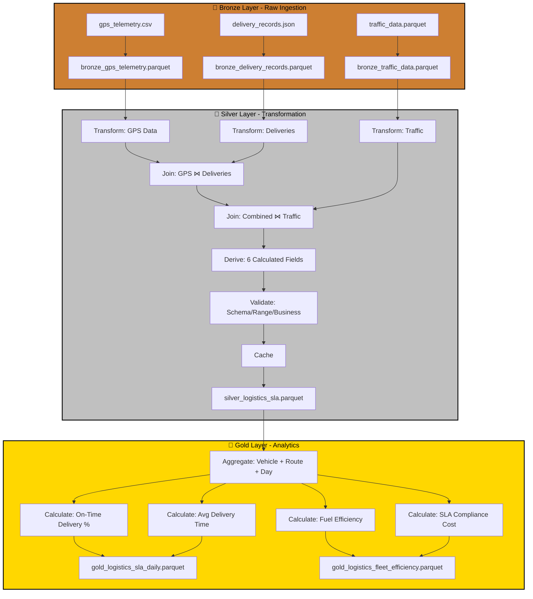

# Case Study: P07 - Logistics Fleet Tracking & Delivery SLA Monitoring

## Project Overview

**Domain:** Logistics  
**Complexity:** Medium  
**Status:** ✅ COMPLETE  
**Total Nodes:** 29 (Bronze: 6, Silver: 14, Gold: 9)  
**Execution Time:** 23.51ms

---

## Business Purpose

Ensure on-time delivery and optimize fleet routes through GPS tracking and SLA monitoring. This system combines vehicle telemetry, delivery records, and traffic data to track fleet performance against service level agreements, identify late deliveries, and optimize routing strategies. By correlating GPS location data with delivery timestamps and real-time traffic conditions, the platform helps logistics managers understand delay patterns, quantify SLA compliance costs, and improve fuel efficiency. The insights enable proactive customer communication, route optimization, and data-driven decisions on fleet expansion or routing changes.

---

## Data Sources

### Bronze Layer (3 Sources)

1. **gps_telemetry.csv** (400 rows)
   - Schema: timestamp, vehicle_id, latitude, longitude, speed_kph, fuel_level_pct
   - Refresh: 15-minute intervals
   - Purpose: Real-time fleet tracking

2. **delivery_records.json** (150 rows)
   - Schema: delivery_id, vehicle_id, customer_id, scheduled_time, actual_delivery_time, delivery_status, distance_km
   - Refresh: Real-time
   - Purpose: Delivery completion tracking

3. **traffic_data.parquet** (168 rows)
   - Schema: timestamp, route_id, congestion_level, avg_speed_kph, incidents
   - Refresh: Hourly
   - Purpose: Traffic impact analysis

**Total Bronze Nodes:** 6 (3 connect + 3 publish)

---

## Architecture

---

## Transformation Highlights

### Silver Layer Joins

1. **GPS Telemetry ⋈ Delivery Records** (on vehicle_id + time range)
   - Links vehicle location to delivery events
   - Calculates actual travel time and distance

2. **Combined ⋈ Traffic Data** (on route_id derived from GPS coordinates)
   - Correlates delays with traffic congestion
   - Quantifies external factors affecting SLA compliance

### Derived Fields (6)

| Field | Formula | Purpose |
|-------|---------|---------|
| `delivery_delay_minutes` | diff(scheduled_time, actual_delivery_time) | SLA performance |
| `on_time_delivery` | delivery_delay_minutes <= 15 | Binary SLA metric |
| `fuel_efficiency_kpl` | distance_km / fuel_consumed | Cost optimization |
| `avg_speed_kph` | distance_km / duration_hours | Route performance |
| `traffic_impact_score` | correlation(delivery_delay, congestion_level) | External factors |
| `sla_compliance_rate` | count(on_time_delivery) / total_deliveries | Service quality |

### Validations

- **Schema Check:** Required fields (vehicle_id, delivery_id, timestamp)
- **Range Validation:** speed_kph 0-120, fuel_level 0-100%
- **Business Rule:** distance_km must be > 0 for completed deliveries

---

## Key Performance Indicators

### Gold Layer KPIs (4)

#### 1. On-Time Delivery Percentage
**Formula:** `OTD% = On-Time Deliveries / Total Deliveries × 100`
- **On-Time Definition:** Within 15 minutes of scheduled time
- **Target:** > 95%
- **Aggregation:** By vehicle, route, day, driver

#### 2. Average Delivery Time
**Formula:** `Avg Time = Σ Delivery Duration / Count(Deliveries)`
- **Unit:** Minutes
- **Breakdown:** By route, time of day, traffic conditions
- **Use Case:** Route optimization and scheduling

#### 3. Fuel Efficiency
**Formula:** `Efficiency = Total Distance / Total Fuel Consumed`
- **Unit:** km/L
- **Target:** > 8 km/L for fleet average
- **Use Case:** Cost management and sustainability tracking

#### 4. SLA Compliance Cost
**Formula:** `Cost = Late Deliveries × Penalty + Failed Deliveries × Refund`
- **Unit:** USD
- **Target:** < 1% of revenue
- **Use Case:** Financial impact of service failures

---

## Node Count Summary

| Layer | Node Types | Count |
|-------|-----------|-------|
| **Bronze** | 3 connect + 3 publish | 6 |
| **Silver** | 3 connect + 3 transform + 2 join + 1 validate + 1 cache + 4 publish | 14 |
| **Gold** | 1 connect + 4 transform + 4 publish | 9 |
| **TOTAL** | | **29** |

---

## Lessons Learned

This project showcases geospatial analysis with route optimization, highlighting ODIBI_CORE's ability to handle time-windowed joins between GPS streams and delivery events. The traffic correlation proved essential for distinguishing controllable delays (routing, driver performance) from external factors (congestion, incidents), enabling more accurate driver performance evaluation and targeted route improvements.

---

*Generated by ODIBI_CORE Case Study Generator*  
*Project: P07 | Status: COMPLETE | Date: 2025-11-02*
