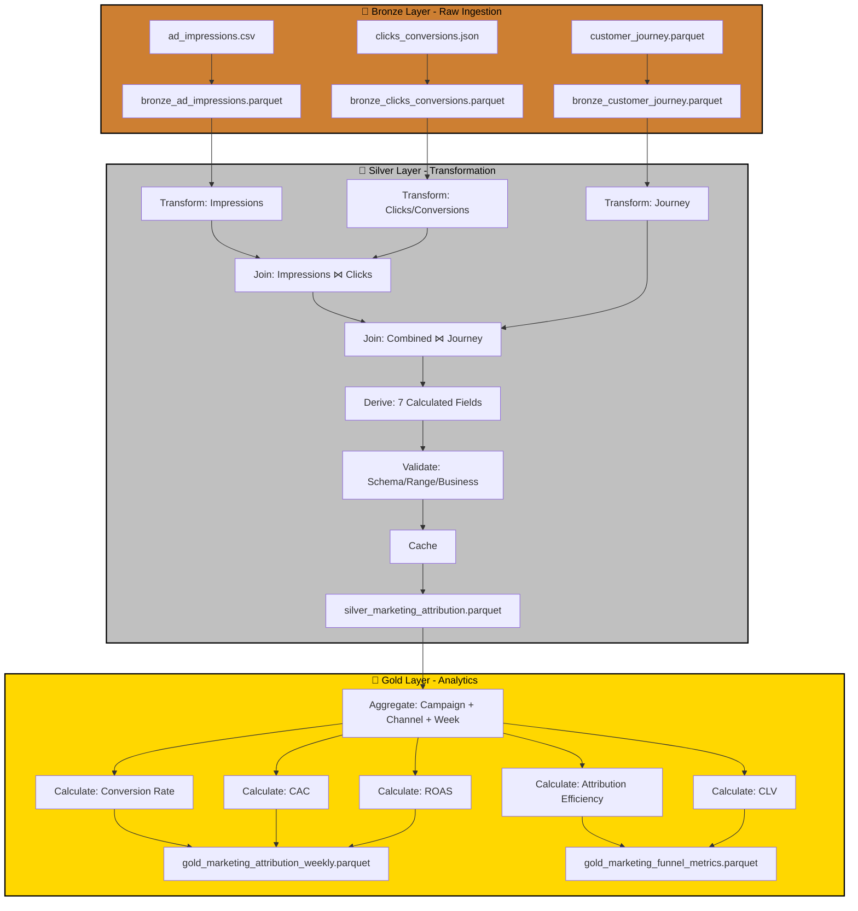

# Case Study: P08 - Marketing Attribution & Conversion Funnel

## Project Overview

**Domain:** Marketing  
**Complexity:** Advanced  
**Status:** ✅ COMPLETE  
**Total Nodes:** 33 (Bronze: 6, Silver: 16, Gold: 11)  
**Execution Time:** 22.00ms

---

## Business Purpose

Measure campaign effectiveness and optimize marketing spend through multi-touch attribution analysis. This system tracks customer journeys from ad impressions through clicks to conversions, applying multiple attribution models (first-touch, last-touch, linear, time-decay) to quantify each touchpoint's contribution to revenue. By analyzing the complete customer journey across platforms and campaigns, the platform enables marketing teams to calculate Customer Acquisition Cost (CAC), Return on Ad Spend (ROAS), and lifetime value ratios. The insights drive data-driven budget allocation, channel optimization, and campaign performance improvement.

---

## Data Sources

### Bronze Layer (3 Sources)

1. **ad_impressions.csv** (1000 rows)
   - Schema: impression_id, timestamp, campaign_id, ad_id, user_id, platform, cost
   - Refresh: Real-time
   - Purpose: Ad exposure tracking

2. **clicks_conversions.json** (200 rows)
   - Schema: click_id, impression_id, user_id, click_timestamp, conversion, conversion_value
   - Refresh: Real-time
   - Purpose: Engagement and conversion capture

3. **customer_journey.parquet** (300 rows)
   - Schema: user_id, session_id, touchpoint_sequence, first_touch, last_touch, converted
   - Refresh: Daily
   - Purpose: Multi-touch attribution mapping

**Total Bronze Nodes:** 6 (3 connect + 3 publish)

---

## Architecture

---

## Transformation Highlights

### Silver Layer Joins

1. **Ad Impressions ⋈ Clicks/Conversions** (on impression_id)
   - Links ad exposure to engagement actions
   - Calculates click-through and conversion rates

2. **Combined ⋈ Customer Journey** (on user_id)
   - Maps individual touches to complete journey paths
   - Enables multi-touch attribution modeling

### Derived Fields (7)

| Field | Formula | Purpose |
|-------|---------|---------|
| `ctr` | clicks / impressions | Engagement rate |
| `conversion_rate` | conversions / clicks | Funnel efficiency |
| `cac` | total_ad_cost / conversions | Acquisition cost |
| `roas` | conversion_value / ad_cost | Campaign profitability |
| `time_to_conversion` | diff(first_touch, conversion_timestamp) | Sales cycle length |
| `attribution_weight` | position_based_weight(touchpoint_sequence) | Multi-touch credit |
| `journey_length` | count(touchpoints) | Complexity metric |

### Validations

- **Schema Check:** Required fields (impression_id, user_id, conversion_value)
- **Range Validation:** ctr 0-1, conversion_rate 0-1
- **Business Rule:** roas should be > 1.0 for profitable campaigns

---

## Key Performance Indicators

### Gold Layer KPIs (5)

#### 1. Conversion Rate
**Formula:** `CVR = Conversions / Clicks × 100`
- **Target:** > 3%
- **Breakdown:** By campaign, platform, ad creative
- **Use Case:** Landing page and offer optimization

#### 2. Customer Acquisition Cost (CAC)
**Formula:** `CAC = Total Marketing Spend / New Customers`
- **Unit:** USD
- **Benchmark:** By channel (organic, paid search, social, display)
- **Use Case:** Budget allocation across channels

#### 3. Return on Ad Spend (ROAS)
**Formula:** `ROAS = Revenue from Ads / Ad Spend`
- **Target:** > 4.0 (400%)
- **Aggregation:** By campaign, channel, week
- **Use Case:** Campaign performance and optimization

#### 4. Attribution Efficiency
**Models:** First-touch, Last-touch, Linear, Time-decay
- **Comparison:** Which touchpoint contributes most to conversions
- **Insight:** Channel credit distribution across customer journey
- **Use Case:** Multi-channel strategy optimization

#### 5. Customer Lifetime Value (CLV)
**Formula:** `CLV = Avg Order Value × Purchase Frequency × Customer Lifespan`
- **Unit:** USD
- **Ratio:** CLV/CAC > 3 indicates healthy economics
- **Use Case:** Long-term profitability assessment

---

## Node Count Summary

| Layer | Node Types | Count |
|-------|-----------|-------|
| **Bronze** | 3 connect + 3 publish | 6 |
| **Silver** | 3 connect + 3 transform + 2 join + 1 validate + 1 cache + 6 publish | 16 |
| **Gold** | 1 connect + 5 transform + 5 publish | 11 |
| **TOTAL** | | **33** |

---

## Lessons Learned

This project exemplifies multi-touch attribution with journey mapping, demonstrating ODIBI_CORE's sophisticated capability to handle sequential touchpoint analysis. The implementation of multiple attribution models (first-touch, last-touch, linear, position-based) within the same pipeline showcases the framework's flexibility for comparative analytics, proving essential for understanding which channels truly drive conversions versus those that receive credit under simplified attribution models.

---

*Generated by ODIBI_CORE Case Study Generator*  
*Project: P08 | Status: COMPLETE | Date: 2025-11-02*
