# Case Study: P09 - Education Outcome Correlation & Cohort Analysis

## Project Overview

**Domain:** Education  
**Complexity:** Medium  
**Status:** ✅ COMPLETE  
**Total Nodes:** 26 (Bronze: 6, Silver: 12, Gold: 8)  
**Execution Time:** 22.00ms

---

## Business Purpose

Identify success factors and improve curriculum through education outcome analysis and cohort tracking. This system analyzes student grades, attendance patterns, and demographic data to quantify correlations between attendance and academic performance, identify at-risk students early, and track graduation rates across cohorts. By correlating attendance rates with GPA and analyzing trends by major and enrollment year, the platform enables academic advisors to intervene proactively, curriculum designers to improve course effectiveness, and administrators to optimize support programs. The insights drive evidence-based decisions to improve student success and institutional outcomes.

---

## Data Sources

### Bronze Layer (3 Sources)

1. **student_grades.csv** (500 rows)
   - Schema: student_id, course_id, semester, grade, grade_points, credits
   - Refresh: End of semester
   - Purpose: Academic performance tracking

2. **attendance_records.json** (150 rows)
   - Schema: student_id, semester, classes_attended, classes_total, attendance_rate
   - Refresh: Weekly
   - Purpose: Engagement monitoring

3. **student_demographics.parquet** (150 rows)
   - Schema: student_id, age, gender, major, enrollment_year, financial_aid
   - Refresh: Semester
   - Purpose: Cohort segmentation

**Total Bronze Nodes:** 6 (3 connect + 3 publish)

---

## Architecture

```mermaid
graph TB
    subgraph Bronze["🥉 Bronze Layer - Raw Ingestion"]
        B1[student_grades.csv]
        B2[attendance_records.json]
        B3[student_demographics.parquet]
        B1 --> B1P[bronze_student_grades.parquet]
        B2 --> B2P[bronze_attendance_records.parquet]
        B3 --> B3P[bronze_student_demographics.parquet]
    end

    subgraph Silver["🥈 Silver Layer - Transformation"]
        B1P --> S1[Transform: Grades]
        B2P --> S2[Transform: Attendance]
        B3P --> S3[Transform: Demographics]
        S1 --> J1[Join: Grades ⋈ Attendance]
        S2 --> J1
        J1 --> J2[Join: Combined ⋈ Demographics]
        S3 --> J2
        J2 --> D1[Derive: 5 Calculated Fields]
        D1 --> V1[Validate: Schema/Range/Business]
        V1 --> C1[Cache]
        C1 --> SP[silver_education_outcomes.parquet]
    end

    subgraph Gold["🥇 Gold Layer - Analytics"]
        SP --> G1[Aggregate: Cohort + Major + Semester]
        G1 --> K1[Calculate: Graduation Rate]
        G1 --> K2[Calculate: GPA Trends]
        G1 --> K3[Calculate: Attendance Correlation]
        G1 --> K4[Calculate: At-Risk Student Rate]
        K1 --> GP1[gold_education_graduation_rates.parquet]
        K2 --> GP1
        K3 --> GP2[gold_education_correlation_analysis.parquet]
        K4 --> GP2
    end

    style Bronze fill:#cd7f32,stroke:#000,stroke-width:2px,color:#000
    style Silver fill:#c0c0c0,stroke:#000,stroke-width:2px,color:#000
    style Gold fill:#ffd700,stroke:#000,stroke-width:2px,color:#000
```

---

## Transformation Highlights

### Silver Layer Joins

1. **Student Grades ⋈ Attendance Records** (on student_id + semester)
   - Links academic performance to class attendance
   - Enables correlation analysis between engagement and outcomes

2. **Combined ⋈ Student Demographics** (on student_id)
   - Adds cohort and major context to performance data
   - Enables segmented analysis by enrollment year and program

### Derived Fields (5)

| Field | Formula | Purpose |
|-------|---------|---------|
| `gpa` | sum(grade_points × credits) / sum(credits) | Academic performance |
| `attendance_impact` | correlation(attendance_rate, grade_points) | Engagement correlation |
| `at_risk_flag` | gpa < 2.0 OR attendance_rate < 0.75 | Early warning system |
| `credits_earned` | sum(credits WHERE grade != 'F') | Progress tracking |
| `progression_rate` | credits_earned / expected_credits | On-track indicator |

### Validations

- **Schema Check:** Required fields (student_id, course_id, grade_points)
- **Range Validation:** grade_points 0-4.0, attendance_rate 0-1
- **Business Rule:** credits must be positive integers

---

## Key Performance Indicators

### Gold Layer KPIs (4)

#### 1. Graduation Rate
**Formula:** `Grad Rate = Graduated Students / Enrolled Students × 100`
- **Cohort:** Track same enrollment year over time
- **Target:** > 80% (4-year programs)
- **Aggregation:** By major, financial aid status, demographics

#### 2. GPA Trends
**Formula:** `Avg GPA = Σ(Grade Points × Credits) / Σ Credits`
- **Breakdown:** By major, cohort, semester
- **Target:** Increasing trend semester-over-semester
- **Use Case:** Curriculum effectiveness assessment

#### 3. Attendance Correlation
**Formula:** `Correlation = Pearson(Attendance Rate, GPA)`
- **Statistical Significance:** p < 0.05
- **Insight:** Quantify attendance impact on academic success
- **Use Case:** Justify attendance policies

#### 4. At-Risk Student Rate
**Formula:** `At-Risk % = (GPA < 2.0 OR Attendance < 75%) / Total Students × 100`
- **Early Warning:** Identify students needing intervention
- **Target:** < 15%
- **Use Case:** Proactive academic advising

---

## Node Count Summary

| Layer | Node Types | Count |
|-------|-----------|-------|
| **Bronze** | 3 connect + 3 publish | 6 |
| **Silver** | 3 connect + 3 transform + 2 join + 1 validate + 1 cache + 2 publish | 12 |
| **Gold** | 1 connect + 4 transform + 3 publish | 8 |
| **TOTAL** | | **26** |

---

## Lessons Learned

This project demonstrates correlation analysis with cohort tracking, showcasing ODIBI_CORE's ability to handle longitudinal educational data. The dual-condition at-risk flag (GPA < 2.0 OR attendance < 75%) proved more effective than single-metric approaches, identifying different student populations requiring intervention. This implementation highlights the value of multi-dimensional early warning systems in education analytics.

---

*Generated by ODIBI_CORE Case Study Generator*  
*Project: P09 | Status: COMPLETE | Date: 2025-11-02*
