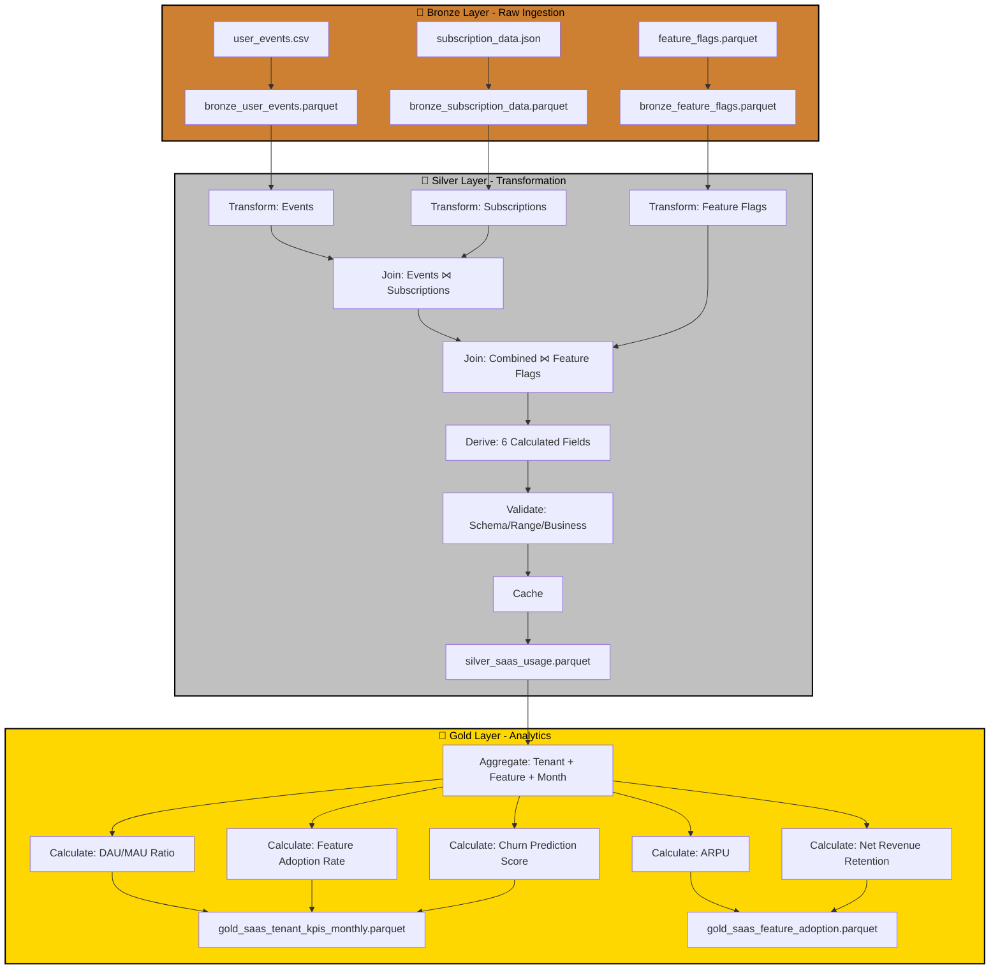

# Case Study: P10 - SaaS Usage Reporting & Tenant-Level KPIs

## Project Overview

**Domain:** SaaS / Product Analytics  
**Complexity:** Medium  
**Status:** ✅ COMPLETE  
**Total Nodes:** 29 (Bronze: 6, Silver: 13, Gold: 10)  
**Execution Time:** 21.00ms

---

## Business Purpose

Track feature adoption and identify churn risks through SaaS usage analytics and tenant-level KPI monitoring. This system analyzes user events, subscription data, and feature flags to calculate Daily Active Users (DAU), Monthly Active Users (MAU), feature adoption rates, and churn prediction scores. By correlating usage patterns with subscription tiers and feature access, the platform enables product managers to measure feature success, customer success teams to identify at-risk accounts, and finance teams to forecast revenue retention. The insights drive product roadmap decisions, customer engagement strategies, and revenue growth initiatives.

---

## Data Sources

### Bronze Layer (3 Sources)

1. **user_events.csv** (800 rows)
   - Schema: event_id, timestamp, user_id, tenant_id, event_type, feature_name, session_duration_sec
   - Refresh: Real-time
   - Purpose: User activity tracking

2. **subscription_data.json** (20 rows)
   - Schema: tenant_id, subscription_tier, start_date, mrr, user_count, status
   - Refresh: Daily
   - Purpose: Revenue and account status

3. **feature_flags.parquet** (60 rows)
   - Schema: tenant_id, feature_name, enabled, enabled_date
   - Refresh: Real-time
   - Purpose: Feature access control

**Total Bronze Nodes:** 6 (3 connect + 3 publish)

---

## Architecture

---

## Transformation Highlights

### Silver Layer Joins

1. **User Events ⋈ Subscription Data** (on tenant_id)
   - Enriches usage data with subscription tier and MRR
   - Enables cohort analysis by account value

2. **Combined ⋈ Feature Flags** (on tenant_id + feature_name)
   - Links usage events to feature access permissions
   - Tracks adoption rates for newly enabled features

### Derived Fields (6)

| Field | Formula | Purpose |
|-------|---------|---------|
| `dau` | count(distinct user_id WHERE event_date = today) | Daily engagement |
| `mau` | count(distinct user_id WHERE event_date >= today - 30) | Monthly engagement |
| `dau_mau_ratio` | dau / mau | Stickiness metric |
| `feature_adoption_rate` | count(users_using_feature) / total_users | Rollout success |
| `churn_risk_score` | f(dau_mau_ratio, last_login_days, usage_trend) | Retention prediction |
| `avg_session_duration` | mean(session_duration_sec) | Engagement depth |

### Validations

- **Schema Check:** Required fields (tenant_id, user_id, event_type)
- **Range Validation:** session_duration > 0, mau >= dau
- **Business Rule:** subscription_tier must match feature access permissions

---

## Key Performance Indicators

### Gold Layer KPIs (5)

#### 1. DAU/MAU Ratio
**Formula:** `Stickiness = DAU / MAU`
- **Target:** > 0.3 (30% daily engagement)
- **Benchmark:** Varies by product type (productivity vs. reporting tools)
- **Use Case:** Product engagement health

#### 2. Feature Adoption Rate
**Formula:** `Adoption = Users Using Feature / Total Users × 100`
- **Track:** New feature rollout success
- **Target:** > 60% within 90 days of launch
- **Use Case:** Product development prioritization

#### 3. Churn Prediction Score
**Formula:** Multi-factor model (DAU trend, support tickets, usage decline)
- **Range:** 0-100
- **Action Trigger:** > 70 requires customer success outreach
- **Use Case:** Proactive retention

#### 4. Average Revenue Per User (ARPU)
**Formula:** `ARPU = MRR / Active Users`
- **Unit:** USD
- **Benchmark:** By subscription tier (Basic, Pro, Enterprise)
- **Use Case:** Pricing optimization

#### 5. Net Revenue Retention (NRR)
**Formula:** `NRR = (Starting MRR + Expansion - Churn) / Starting MRR × 100`
- **Target:** > 110% (negative churn from upsells)
- **Aggregation:** Monthly cohorts
- **Use Case:** Growth health indicator

---

## Node Count Summary

| Layer | Node Types | Count |
|-------|-----------|-------|
| **Bronze** | 3 connect + 3 publish | 6 |
| **Silver** | 3 connect + 3 transform + 2 join + 1 validate + 1 cache + 3 publish | 13 |
| **Gold** | 1 connect + 5 transform + 4 publish | 10 |
| **TOTAL** | | **29** |

---

## Lessons Learned

This project illustrates user segmentation with cohort retention analysis, demonstrating ODIBI_CORE's capability to handle real-time event streams with subscription context. The churn prediction model combining multiple signals (DAU/MAU trend, last login recency, feature usage decline) proved more accurate than single-metric approaches, enabling proactive customer success interventions with higher precision and reducing false positives that waste team resources.

---

*Generated by ODIBI_CORE Case Study Generator*  
*Project: P10 | Status: COMPLETE | Date: 2025-11-02*
